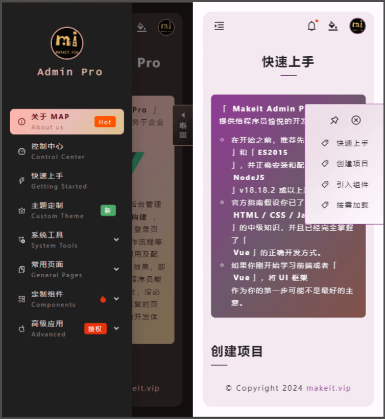

<div align="center">

[](https://admin.makeit.vip)

</div>

<h1 align="center">
    <a href="https://admin.makeit.vip" target="_blank">
        Makeit Admin Pro 3.x
    </a>
</h1>

<div align="center">

<p align="center">

<div>

基于 `Vue3.x` 构建的适用于中后台管理系统的开箱即用的组合模板框架

</div>

<div>

( An out-of-box UI solution for enterprise applications built on Vue3.x )

</div>

</p>

[](https://www.npmjs.com/package/@miitvip/admin-pro)
[](http://www.npmtrends.com/@miitvip/admin-pro)


</div>

## 注意
>
> `3.x` 版本的 `npm` 包更名为 **[`@miitvip/admin-pro`](https://www.npmjs.com/package/@miitvip/admin-pro)**
>
> `2.x` 版本的 `npm` 包在这里 **[`makeit-admin-pro`](https://www.npmjs.com/package/makeit-admin-pro)**
>
> `3.x` 版本体验地址 「 **[https://admin.makeit.vip](https://admin.makeit.vip)** 」
>
> `2.x` 版本体验地址 「 **[https://2x.makeit.vip](https://2x.makeit.vip)** 」
>

## 关于
>
> :triangular_flag_on_post: **`Makeit Admin Pro`** 是基于 **`Vue 3.x + Vite 5.x + Ant Design Vue 4.x`** 构建开发的一套适合中后台管理项目的 **`UI 框架`**。
> >
> :beginner: 框架内置了统一风格的页面布局 / 注册页面 / 登录页面 / 忘记密码 / 滑块验证码组件 / 搜索联想组件 / 动态菜单配置 / 权限管理配置等常用模块，**开箱即用**。
> >
> :lollipop: 设计这套框架的初衷是为了免去中后台管理项目中**基础又重复的页面构建**，将页面内的一系列行为进行封装形成重型组件（**一个组件 ≈ 一个页面**），如基础布局 `Layout`，登录 `Login` / 注册 `Register` / 忘记密码 `Forget` 等页面模块，让开发人员能更加专注于业务内容的开发，无需花费过多的时间在基础构建上，希望可以通过 `Makeit Admin Pro` 系列组件提供快速高效的搭建高质量的中后台应用，现阶段还在不断完善，持续开发更新中 ...
>

## 效果图

### 深色主题

[](https://admin.makeit.vip)

### 浅色主题

[](https://admin.makeit.vip)

### 更换主题

[](https://admin.makeit.vip)

### 收合菜单

[](https://admin.makeit.vip)

### 手机效果

[](https://admin.makeit.vip)

## 全局应用

:white_check_mark: **主题配置** ( `css modules + css variables` )

:white_check_mark: **国际化** ( `vue-i18n` )

:white_check_mark: **Cookie** ( `document.cookie` )

:white_check_mark: **Storage** ( `localStorage & sessionStorage` )

:white_check_mark: **Request** ( `axios` )

:white_check_mark: **Global** ( 全局配置 `global configuration` )

:white_check_mark: **Tools** ( 全局公用函数库 `global functions` )

## 基础组件

:white_check_mark: **[基础布局](https://admin.makeit.vip/component/layout)** ( [`Layout`](./src/components/layout/README.md) ) :sparkling_heart:

:white_check_mark: **[滑块验证码](./src/components/captcha/README.md)** ( [`Captcha`](./src/components/captcha/README.md) ) :collision:

:white_check_mark: **[锚点链接](./src/components/anchor/README.md)** ( [`Anchor`](./src/components/anchor/README.md) ) :balloon:

:white_check_mark: **[在线钟表](https://admin.makeit.vip/component/clock)** ( [`Clock`](./src/components/clock/README.md) ) :clock130:

:white_check_mark: **[下拉菜单](https://admin.makeit.vip/component/dropdown)** ( [`Dropdown`](./src/components/dropdown/README.md) ) :palm_tree:

:white_check_mark: **[忘记密码](https://admin.makeit.vip/page/forget)** ( [`Forget`](./src/components/forget/README.md) ) :hammer:

:white_check_mark: **[链接地址](https://admin.makeit.vip/component/link)** ( [`Link`](./src/components/link/README.md) ) :guitar:

:white_check_mark: **[调色面板](https://admin.makeit.vip/component/palette)** ( [`Palette`](./src/components/palette/README.md) ) :books:

:white_check_mark: **[登录页面](https://admin.makeit.vip/page/login)** ( [`Login`](./src/components/login/README.md) ) :cherries:

:white_check_mark: **[注册页面](https://admin.makeit.vip/page/register)** ( [`Register`](./src/components/register/README.md) ) :european_castle:

:white_check_mark: **[授权登录](https://admin.makeit.vip/component/socialite)** ( [`Socialite`](./src/components/socialite/README.md) ) :dizzy:

:white_check_mark: **[菜单导航](https://admin.makeit.vip/component/menu)** ( [`Menu`](./src/components/menu/README.md) ) :rocket:

:white_check_mark: **[弹窗动效](https://admin.makeit.vip/component/modal)** ( [`Modal`](./src/components/modal/README.md) ) :traffic_light:

:white_check_mark: **[消息中心](https://admin.makeit.vip/component/notice)** ( [`Notice`](./src/components/notice/README.md) ) :round_pushpin:

:white_check_mark: **[密码设置](https://admin.makeit.vip/component/password)** ( [`Password`](./src/components/password/README.md) ) :u7981:

:white_check_mark: **[搜索组件](https://admin.makeit.vip/component/search)** ( [`Search`](./src/components/search/README.md) ) :bookmark_tabs:

:white_check_mark: **[代码高亮](https://admin.makeit.vip/component/code)** ( [`Code`](./src/components/code/README.md) ) :flight_arrival:

:white_check_mark: **[标题设置](https://admin.makeit.vip/component/title)** ( [`Title`](./src/components/title/README.md) ) :palm_tree:

:white_check_mark: **[引用说明](https://admin.makeit.vip/component/quote)** ( [`Quotes`](./src/components/quote/README.md) ) :hash:

:white_check_mark: **[回到顶部](https://admin.makeit.vip/component/backtop)** ( [`Backtop`](./src/components/backtop/README.md) ) :top:

:white_check_mark: **[历史路由](https://admin.makeit.vip/component/historical)** ( [`History`](./src/components/historical/README.md) ) :guitar:

:white_check_mark: **[文案排版](https://admin.makeit.vip/items/text)** ( [`ItemsText`](./src/components/items/text/README.md) ) :date:

## 高级应用

:white_check_mark: **[语言配置](https://admin.makeit.vip/advanced/language)** ( [`AppsLanguage`](./src/components/apps/language/README.md) ) :snowflake:

:white_check_mark: **[菜单管理 ( 动态路由 )](https://admin.makeit.vip/advanced/menu)** ( [`AppsMenu`](./src/components/apps/menu/README.md) ) :triangular_flag_on_post:

:x: 权限控制 :sunglasses:

:x: 应用管理 :rose:

:x: 富文本编辑器 :ocean:

:x: 地域选择 :heart_eyes_cat:

:x: 异常页面 ( `404` ) :sleeping:

:x: 个人中心 :heart_eyes:

:sparkles: ······

## 安装使用

```bash
npm i @miitvip/admin-pro
```

## 全局引入

```ts
import { createApp } from 'vue'
import MakeitAdminPro from '@miitvip/admin-pro'
import App from './app.vue'

const app = createApp(App)
app.use(MakeitAdminPro)
app.mount('#app')
```

## 按需加载

```ts
import { createApp } from 'vue'
import router from './router'
import App from './app.vue'
import { Layout, Notice } from '@miitvip/admin-pro'

const app = createApp(App)
app.use(router)
const components = [Layout, Notice]
components.forEach((component) => app.use(component))
app.mount('#app')
```

## 基础布局

```html
<template>
    <mi-layout />
</template>

<script lang="ts" setup>
    import { useStoreMenu } from '@miitvip/admin-pro'

    // 更新菜单
    const menuStore = useStoreMenu()
    menuStore.updateMenus([
        {
            name: 'dashboard',
            path: '/dashboard',
            meta: {
                title: '控制中心',
                subTitle: 'Dashboard',
                icon: DashboardOutlined,
                tag: {color: '#f50', content: 'Hot'}
            }
        }, {
            // ... sider menus
        }
    ])
</script>
```

## 登录页面

```vue
<template>
    <mi-login action="/v1/login" />
</template>
```

## 注册页面

```vue
<template>
    <mi-register action="/v1/register" />
</template>
```

## 更多应用

> 更多内容及使用请查看在线示例：**[https://admin.makeit.vip](https://admin.makeit.vip)**
